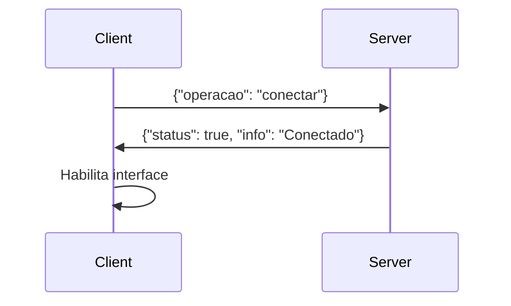
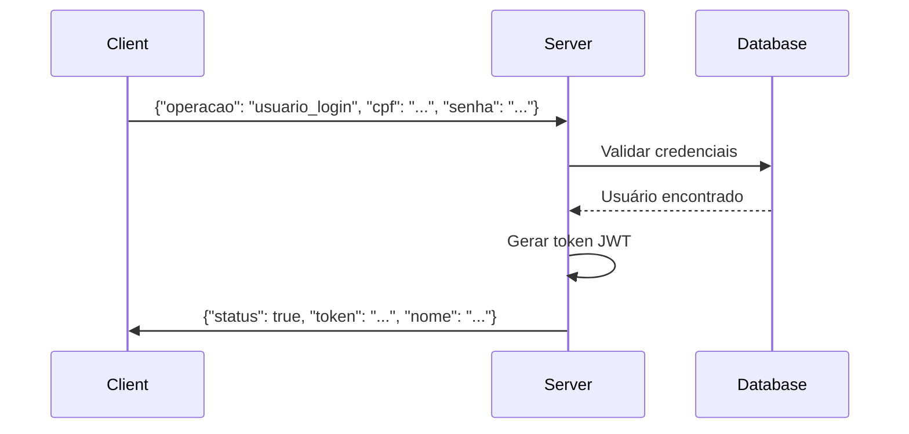
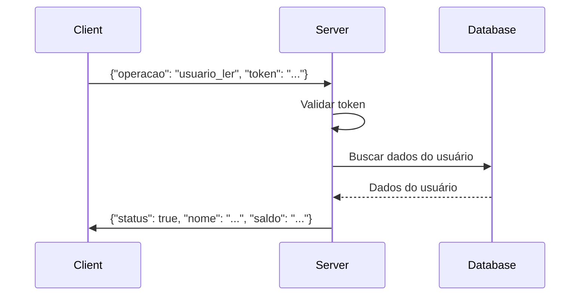

# Guia de Desenvolvimento

Este documento fornece informações detalhadas para desenvolvedores que desejam trabalhar no sistema.

## Configuração do Ambiente

### Pré-requisitos

- **Java 11+** (testado com Java 25)
- **Maven 3.6+**
- **Git** para controle de versão
- **IDE** recomendada: IntelliJ IDEA ou Eclipse

### Configuração Inicial

1. **Clone o repositório:**
   ```bash
   git clone <url-do-repositorio>
   cd validador-sistemas-distribuidos
   ```

2. **Compile o projeto:**
   ```bash
   mvn clean compile
   ```

3. **Execute os testes:**
   ```bash
   mvn test
   ```

4. **Gere o JAR:**
   ```bash
   mvn package
   ```

## Arquitetura do Sistema

### Visão Geral

```
┌─────────────────┐    TCP/JSON    ┌─────────────────┐
│   Cliente GUI   │ ◄─────────────► │   Servidor      │
│   (Swing)       │                │   (Multi-thread)│
└─────────────────┘                └─────────────────┘
                                           │
                                           ▼
                                   ┌─────────────────┐
                                   │   SQLite DB     │
                                   │   (usuarios.db) │
                                   └─────────────────┘
```

### Componentes Principais

#### 1. Cliente (`src/main/java/com/distribuidos/client/`)

- **ClientMain.java**: Ponto de entrada da aplicação cliente
- **ClientGUI.java**: Interface gráfica em Swing
- **ClientConnection.java**: Gerenciamento de conexão com servidor

#### 2. Servidor (`src/main/java/com/distribuidos/server/`)

- **ServerMain.java**: Ponto de entrada da aplicação servidor
- **ServerGUI.java**: Interface gráfica de administração
- **ServerHandler.java**: Manipulação de clientes conectados

#### 3. Comum (`src/main/java/com/distribuidos/common/`)

- **Usuario.java**: Modelo de dados do usuário
- **ClientInfo.java**: Informações do cliente conectado
- **MessageBuilder.java**: Construção de mensagens JSON
- **TokenManager.java**: Gerenciamento de tokens JWT

#### 4. Banco (`src/main/java/com/distribuidos/database/`)

- **DatabaseManager.java**: CRUD e gerenciamento SQLite

#### 5. Validação (`Essentials/`)

- **Validator.java**: Validação de protocolo
- **RulesEnum.java**: Regras de negócio

## Fluxo de Dados

### 1. Conexão do Cliente



### 2. Autenticação



### 3. Operações com Token



## Padrões de Código

### Nomenclatura

- **Classes**: PascalCase (`ClientConnection`)
- **Métodos**: camelCase (`connectToServer`)
- **Variáveis**: camelCase (`serverSocket`)
- **Constantes**: UPPER_SNAKE_CASE (`DEFAULT_PORT`)

### Estrutura de Métodos

```java
public ReturnType methodName(ParameterType parameter) {
    // Validação de entrada
    if (parameter == null) {
        throw new IllegalArgumentException("Parameter cannot be null");
    }
    
    // Lógica principal
    try {
        // Implementação
        return result;
    } catch (Exception e) {
        logger.error("Error in methodName: {}", e.getMessage());
        throw new RuntimeException("Operation failed", e);
    }
}
```

### Tratamento de Erros

```java
try {
    // Operação que pode falhar
    result = riskyOperation();
} catch (SpecificException e) {
    logger.warn("Specific error occurred: {}", e.getMessage());
    return defaultValue;
} catch (Exception e) {
    logger.error("Unexpected error: {}", e.getMessage());
    throw new RuntimeException("Operation failed", e);
}
```

## Logging

### Configuração

O logging é configurado via `src/main/resources/logback.xml`:

```xml
<configuration>
    <appender name="CONSOLE" class="ch.qos.logback.core.ConsoleAppender">
        <encoder>
            <pattern>%d{HH:mm:ss.SSS} [%level] %logger{36} - %msg%n</pattern>
        </encoder>
    </appender>
    
    <appender name="FILE" class="ch.qos.logback.core.rolling.RollingFileAppender">
        <file>logs/sistema-distribuido.log</file>
        <rollingPolicy class="ch.qos.logback.core.rolling.TimeBasedRollingPolicy">
            <fileNamePattern>logs/sistema-distribuido.%d{yyyy-MM-dd}.log</fileNamePattern>
            <maxHistory>30</maxHistory>
        </rollingPolicy>
        <encoder>
            <pattern>%d{yyyy-MM-dd HH:mm:ss.SSS} [%level] %thread %logger{36} - %msg%n</pattern>
        </encoder>
    </appender>
    
    <root level="INFO">
        <appender-ref ref="CONSOLE"/>
        <appender-ref ref="FILE"/>
    </root>
</configuration>
```

### Uso do Logger

```java
import org.slf4j.Logger;
import org.slf4j.LoggerFactory;

public class ExampleClass {
    private static final Logger logger = LoggerFactory.getLogger(ExampleClass.class);
    
    public void exampleMethod() {
        logger.info("Starting operation");
        logger.debug("Debug information: {}", debugData);
        logger.warn("Warning: {}", warningMessage);
        logger.error("Error occurred: {}", errorMessage, exception);
    }
}
```

## Testes

### Estrutura de Testes

```
src/test/java/com/distribuidos/
├── test/
│   ├── TransacaoResponseTest.java
│   └── UsuarioDAOTest.java
└── integration/
    ├── ClientServerIntegrationTest.java
    └── DatabaseIntegrationTest.java
```

### Exemplo de Teste Unitário

```java
@Test
public void testUserLogin() {
    // Arrange
    String cpf = "123.456.789-01";
    String senha = "123456";
    
    // Act
    LoginResponse response = authService.login(cpf, senha);
    
    // Assert
    assertNotNull(response);
    assertTrue(response.isSuccess());
    assertNotNull(response.getToken());
}
```

### Executar Testes

```bash
# Todos os testes
mvn test

# Testes específicos
mvn test -Dtest=TransacaoResponseTest

# Testes com relatório de cobertura
mvn test jacoco:report
```

## Banco de Dados

### Esquema SQLite

```sql
CREATE TABLE usuarios (
    cpf TEXT PRIMARY KEY,
    nome TEXT NOT NULL,
    senha TEXT NOT NULL,
    saldo REAL DEFAULT 0.0,
    criado_em DATETIME DEFAULT CURRENT_TIMESTAMP,
    atualizado_em DATETIME DEFAULT CURRENT_TIMESTAMP
);

CREATE TABLE transacoes (
    id INTEGER PRIMARY KEY AUTOINCREMENT,
    cpf_origem TEXT,
    cpf_destino TEXT,
    valor REAL NOT NULL,
    tipo TEXT NOT NULL,
    descricao TEXT,
    criado_em DATETIME DEFAULT CURRENT_TIMESTAMP,
    FOREIGN KEY (cpf_origem) REFERENCES usuarios(cpf),
    FOREIGN KEY (cpf_destino) REFERENCES usuarios(cpf)
);

CREATE INDEX idx_transacoes_cpf_origem ON transacoes(cpf_origem);
CREATE INDEX idx_transacoes_cpf_destino ON transacoes(cpf_destino);
CREATE INDEX idx_transacoes_criado_em ON transacoes(criado_em);
```

### Acesso aos Dados

```java
public class DatabaseManager {
    private static final String DB_URL = "jdbc:sqlite:usuarios.db";
    
    public Usuario findByCpf(String cpf) {
        String sql = "SELECT * FROM usuarios WHERE cpf = ?";
        
        try (Connection conn = DriverManager.getConnection(DB_URL);
             PreparedStatement stmt = conn.prepareStatement(sql)) {
            
            stmt.setString(1, cpf);
            ResultSet rs = stmt.executeQuery();
            
            if (rs.next()) {
                return mapResultSetToUsuario(rs);
            }
            return null;
        } catch (SQLException e) {
            logger.error("Error finding user by CPF: {}", e.getMessage());
            throw new RuntimeException("Database error", e);
        }
    }
}
```

## Segurança

### Criptografia de Senhas

```java
import org.mindrot.jbcrypt.BCrypt;

public class PasswordUtils {
    private static final int BCRYPT_ROUNDS = 12;
    
    public static String hashPassword(String plainPassword) {
        return BCrypt.hashpw(plainPassword, BCrypt.gensalt(BCRYPT_ROUNDS));
    }
    
    public static boolean verifyPassword(String plainPassword, String hashedPassword) {
        return BCrypt.checkpw(plainPassword, hashedPassword);
    }
}
```

### Gerenciamento de Tokens

```java
public class TokenManager {
    private static final String SECRET_KEY = "seu-segredo-muito-seguro";
    private static final long EXPIRATION_TIME = 30 * 60 * 1000; // 30 minutos
    
    public String generateToken(String cpf) {
        return Jwts.builder()
                .setSubject(cpf)
                .setIssuedAt(new Date())
                .setExpiration(new Date(System.currentTimeMillis() + EXPIRATION_TIME))
                .signWith(SignatureAlgorithm.HS256, SECRET_KEY)
                .compact();
    }
    
    public boolean validateToken(String token) {
        try {
            Jwts.parser().setSigningKey(SECRET_KEY).parseClaimsJws(token);
            return true;
        } catch (JwtException e) {
            return false;
        }
    }
}
```

## Deployment

### Build para Produção

```bash
# Compile e gere JARs executáveis
mvn clean package

# JARs gerados:
# target/validador-sistemas-distribuidos-1.0.0-server.jar (servidor)
# target/validador-sistemas-distribuidos-1.0.0-client.jar (cliente)
```

### Configuração de Produção

1. **Configurar banco de dados:**
   - Criar arquivo `usuarios.db` vazio
   - Executar script de inicialização

2. **Configurar logging:**
   - Ajustar nível de log para `WARN` ou `ERROR`
   - Configurar rotação de logs

3. **Configurar rede:**
   - Definir porta do servidor
   - Configurar firewall

### Scripts de Execução

Os scripts estão localizados em `scripts/`:

- `server.bat`: Inicia o servidor
- `client.bat`: Inicia o cliente
- `build.bat`: Compila o projeto
- `clean.bat`: Limpa e recompila

## Contribuição

### Processo de Desenvolvimento

1. **Criar branch:**
   ```bash
   git checkout -b feature/nova-funcionalidade
   ```

2. **Desenvolver:**
   - Implementar funcionalidade
   - Escrever testes
   - Documentar código

3. **Testar:**
   ```bash
   mvn test
   mvn verify
   ```

4. **Commit:**
   ```bash
   git add .
   git commit -m "feat: adiciona nova funcionalidade"
   ```

5. **Push e Pull Request:**
   ```bash
   git push origin feature/nova-funcionalidade
   ```

### Convenções de Commit

- `feat:` Nova funcionalidade
- `fix:` Correção de bug
- `docs:` Documentação
- `style:` Formatação
- `refactor:` Refatoração
- `test:` Testes
- `chore:` Tarefas de manutenção

### Revisão de Código

Antes de fazer merge:

1. ✅ Código compilando sem erros
2. ✅ Todos os testes passando
3. ✅ Cobertura de código adequada
4. ✅ Documentação atualizada
5. ✅ Sem vulnerabilidades de segurança

## Troubleshooting

### Problemas Comuns

#### Erro de Compilação
```bash
# Limpar cache do Maven
mvn clean
rm -rf target/

# Recompilar
mvn compile
```

#### Problema de Conexão
```bash
# Verificar se a porta está em uso
netstat -an | grep :8080

# Matar processos Java
taskkill /F /IM java.exe
```

#### Erro de Banco de Dados
```bash
# Deletar banco corrompido
rm usuarios.db

# Recriar com script
java -cp target/classes com.distribuidos.database.DatabaseSetup
```

### Debug

Para habilitar debug detalhado:

```bash
# Cliente
java -Dlogging.level.com.distribuidos=DEBUG -jar target/client.jar

# Servidor
java -Dlogging.level.com.distribuidos=DEBUG -jar target/server.jar
```

### Monitoramento

Verificar logs em tempo real:

```bash
# Windows
Get-Content logs/sistema-distribuido.log -Tail 10 -Wait

# Linux/Mac
tail -f logs/sistema-distribuido.log
```
